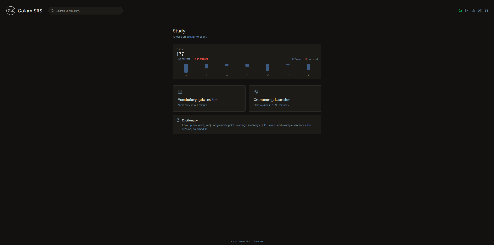
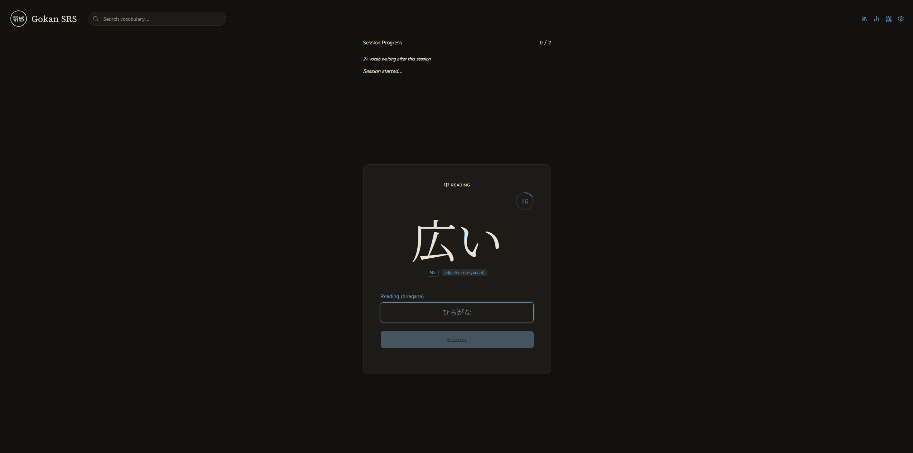
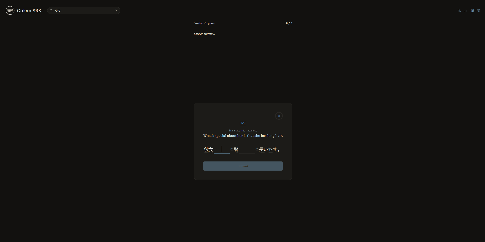
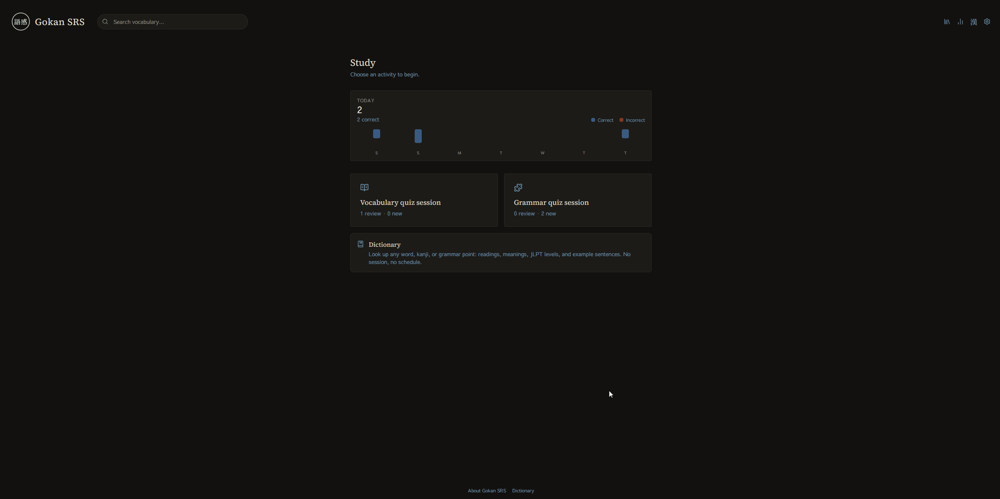
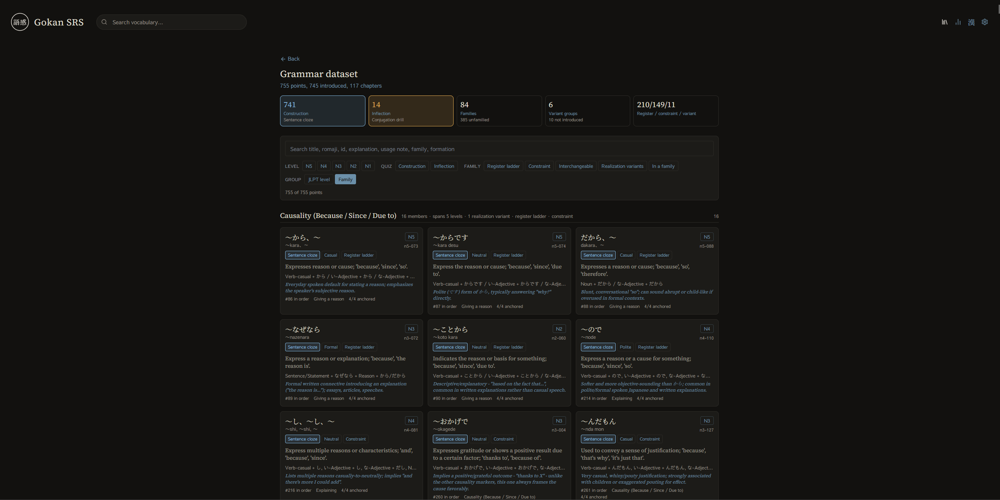
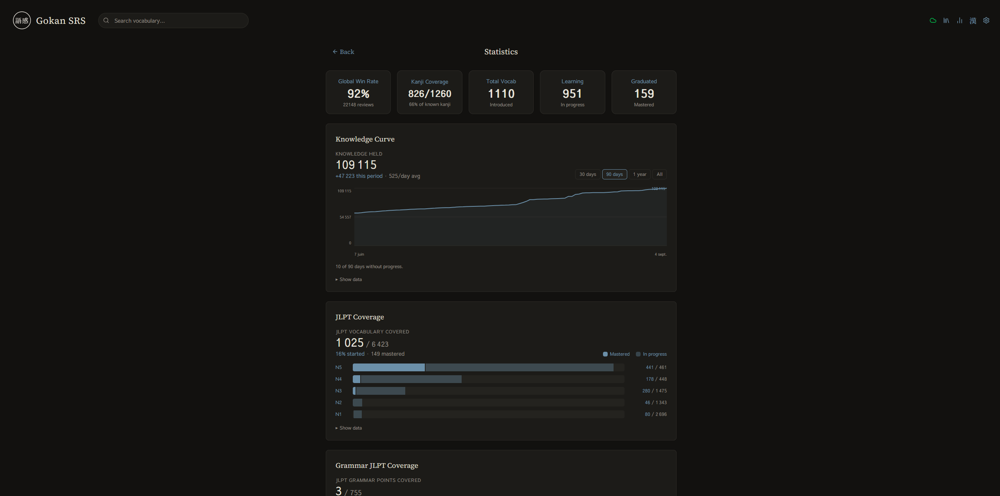
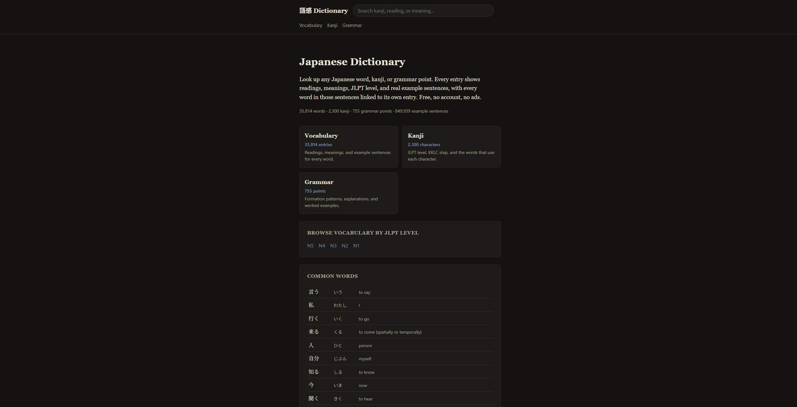
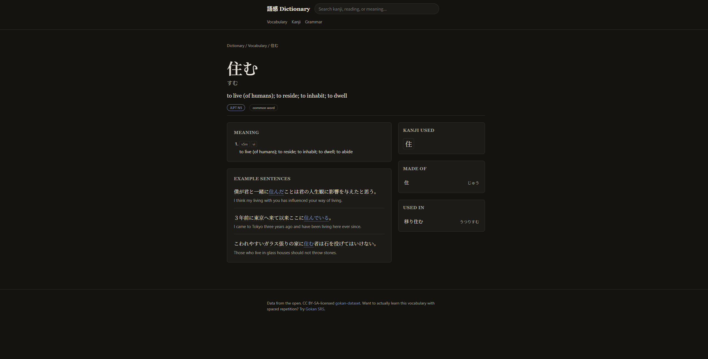

<div align="center">

# 語感 Gokan

**A Japanese vocabulary SRS built around the kanji you already know.**

[Use the app](https://gokan-srs.com) &nbsp;&middot;&nbsp; [Browse the dictionary](https://gokan-srs.com/dictionary/) &nbsp;&middot;&nbsp; [Open dataset](https://github.com/gokan-dev/gokan-dataset)

[](https://github.com/gokan-dev/gokan-srs/actions/workflows/deploy.yml)
[](https://github.com/gokan-dev/gokan-dataset)

</div>

Gokan is a spaced repetition system for Japanese vocabulary. It knows which kanji you have studied, and leads with words built from those kanji.

語感 (*gokan*) means "sense of language": the feel for a word that comes from meeting it enough times, in enough places, that it stops needing translation.



## Why start from the kanji you know

Memorising the shape of a word is a real part of learning it, and Gokan does plenty of that. Nobody holds every kanji of every word in their head, and pretending otherwise would be silly.

But when a word is made of kanji you have already studied, four things happen at once.

**It gives the word something to hang on.** Memory works by connection: a new thing sticks when it attaches to something already there. This is the idea the whole app is built on. It is the same reason a word you once heard in a conversation, or read in a sentence that stuck with you, is the one you never have to look up again. Known kanji are the cheapest, most reliable hook available, because you already carry them.

**It turns memorisation into understanding.** If you know what each kanji means, a compound stops being an arbitrary string and becomes a small story you can tell yourself. That story is what you actually remember.

**It keeps two-kanji words apart.** There are a great many of them, and they are the point where shape alone quietly stops working. Words start blurring into each other, and you find yourself swapping one for another with no idea why. Knowing the components is what pulls them back apart.

**And it works in reverse.** Meeting a kanji inside real words is what turns it from a character you once drilled into one you can read.

None of this is a wall. You are not blocked from words whose kanji you have not reached: working through KKLC toward N5, you will run straight into basic, high-frequency words written with kanji that come much later, and learning those from scratch is completely fine. They teach you the kanji from the other direction. The kanji filter is the default, not a rule, and there is a setting to turn it off.

## Reviews



Each word carries two independent schedules: type the reading in hiragana, and recall the meaning from a real sentence. They are staggered so that answering one does not hand you the other.

Scheduling reacts to how you answer, not just whether you were right. A slow correct answer earns a shorter interval than a fast one, and per-word difficulty adjusts as you go. The target is 75% recall, which is roughly where the research puts the best trade-off between remembering things long-term and reviewing more than you need to.

Get one wrong and it comes back in the same session, but the retry is practice only. It clears the flag without undoing the scheduling penalty, so a word you fumbled does not get to look mastered because you got it on the second try.

## Grammar



755 grammar points from N5 to N1, on their own SRS schedule, drilled as fill-in-the-blank against real sentences rather than as flashcards to recognise.

What is blanked is the grammar pattern itself, located in the sentence when the dataset was built. Vocabulary in the same sentence gets blanked too, as reinforcement, but the pattern is what decides your score: missing a word you happen not to know cannot mark a grammar point wrong when you clearly knew the grammar. It scales the reward instead. Words you do get right feed credit back into their own vocabulary schedules, so grammar practice doubles as vocabulary review.

## Finding words worth learning



Most learners keep a notebook, or a notes app, or a pile of screenshots: words picked up from a game, a stream, a conversation, waiting to be looked up properly and then usually not looked up at all.

Search any word and add it straight to your learning list. That list is the queue, so a word you caught in the wild on Tuesday is simply part of Wednesday's reviews. No transcription step, no second system to maintain, no notebook that slowly becomes a graveyard.

## Grammar library



Every grammar point in the dataset, grouped into families of near-synonyms rather than by level, because the question that actually comes up is "which of these do I want", not "what is on the N3 list".

でも, しかし and けれども sit next to each other where you can compare them. Search covers the family name too, so looking for "contradiction" finds the whole cluster even though no individual point contains that word.

## Progress



Knowledge held over time, JLPT coverage per level, upcoming review load, and daily activity. The knowledge curve is the one worth watching: it shows whether you are accumulating or treading water, which raw review counts hide completely.

## The dictionary



[gokan-srs.com/dictionary](https://gokan-srs.com/dictionary/) is a free Japanese dictionary built from the same data. No account, no tracking, no signup wall, and it works with JavaScript turned off.

35,814 words, 2,300 kanji, and 755 grammar points, each with its own page.



Every word inside every example sentence links to its own entry, so following a sentence you half understand until it comes apart is the natural thing to do rather than a dead end.

## The dataset

[gokan-dataset](https://github.com/gokan-dev/gokan-dataset) is the data both of those read, published as flat static JSON under CC BY-SA 4.0.

JMdict knows what a word means but not how common it is. JPDB knows frequency but not which kanji a learner meets first. Tatoeba has hundreds of thousands of sentences with no link to the words inside them. The dataset does that joining once, at build time, so nobody else has to. If you are building something Japanese-shaped and want vocabulary already connected to kanji, frequency, JLPT level and tokenised example sentences, take it.

## Running it

```bash
git clone --recurse-submodules https://github.com/gokan-dev/gokan-srs.git
cd gokan-srs
bun install
bun run dev
```

The dataset lives in its own repository and the build reads from it, so if you already cloned without submodules, run `git submodule update --init --recursive` first.

```bash
bun run dev              # the SRS app
bun run test             # its test suite
bun run typecheck
bun run dictionary:dev   # the dictionary
bun run dictionary:build # generate all ~38,900 static pages
```

Anything else scopes to one workspace with `--cwd`, for example `bun run --cwd apps/gokan-dictionary test`.

## How it is put together

```
apps/
  gokan-srs/          React 19 SRS app
  gokan-dictionary/   Svelte static site generator, one page per entry
docs/                 Design system, roadmap, modification log
```

No backend. The SRS engine runs entirely in the browser, progress lives in local storage, and Google Drive sync is opt-in and writes a single private file in your own Drive. Hosting is S3 and CloudFront, which is most of why it costs nearly nothing to run and can stay free.

The dataset is not vendored here: `apps/gokan-srs/dataset/` is a submodule, and both apps build from that one checkout so they can never ship different versions of the same data.

| Layer | Choice |
|---|---|
| SRS app | React 19, TypeScript, Tailwind CSS v4 |
| Dictionary | Svelte 5, SCSS, build-time prerendering |
| Build | Vite (rolldown), Bun |
| Tests | Vitest |
| Hosting | S3 and CloudFront, provisioned with Terraform |

Architecture notes are in [CLAUDE.md](CLAUDE.md), the visual language in [docs/DESIGN_SYSTEM.md](docs/DESIGN_SYSTEM.md).

## Credits

Built on other people's work, all of it free:

- [JMdict](https://www.edrdg.org/jmdict/j_jmdict.html) by the Electronic Dictionary Research and Development Group, for dictionary entries and glosses
- [Tatoeba](https://tatoeba.org) for example sentences
- [KKLC](https://www.kanjialive.com) kanji ordering, via [ppasupat/vocab-kanji](https://github.com/ppasupat/vocab-kanji)
- [JPDB](https://jpdb.io) for frequency data
- [JLPT_Vocabulary](https://github.com/Bluskyo/JLPT_Vocabulary), sourced from Jonathan Waller's tanos.co.uk
- [hanabira.org](https://hanabira.org) for grammar points

Licensing for the compiled data is documented in the [dataset repository](https://github.com/gokan-dev/gokan-dataset#license), since each source carries its own terms.
